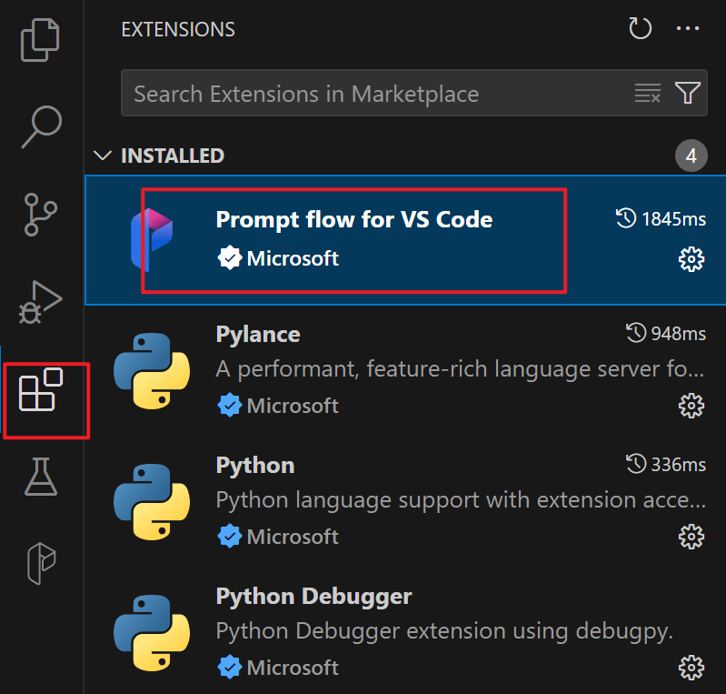
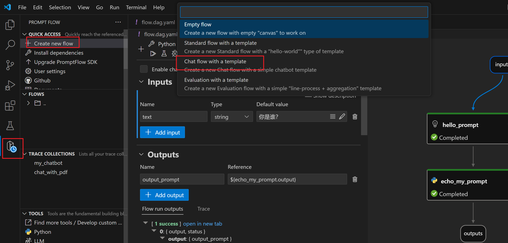
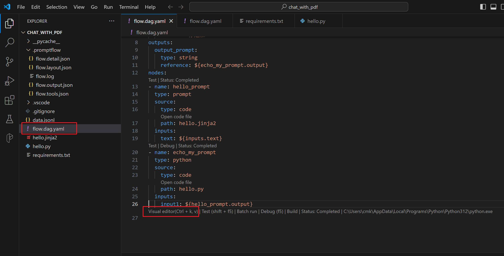
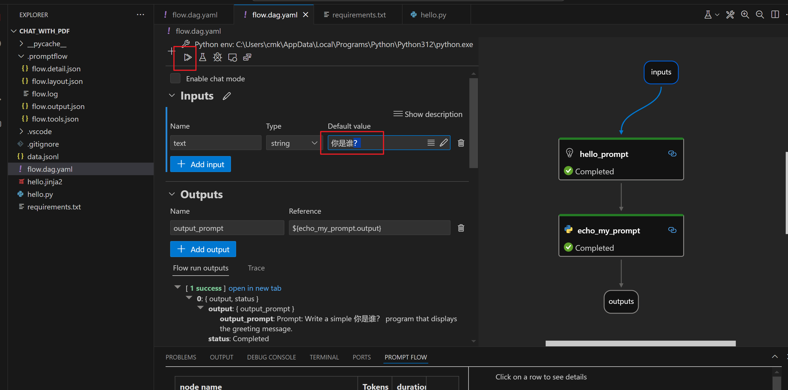

## 前言

官方链接：https://microsoft.github.io/promptflow/how-to-guides/quick-start.html

中文建议：https://geekdaxue.co/read/promptflow/readme

建议开发工具：VSCode

## 快速入门

### 1. 安装PromptFlow

```
pip install promptflow promptflow-tools
```

### 2. 新建demo工程

```shell
pf flow init --flow ./my_chatbot --type chat
```

### 3.替代 api_key

替换openai.yaml中的api_key

> 聊天使用的是chatgpt，所以用的chatgpt的api_key,如果只想试一试，新建工程的是新建个空的模板工程即可。


### 4. 运行chatbot

```
pf flow test --flow ./my_chatbot --interactive
```

## 使用vscode插件

### 插件安装
插件名称
`Prompt flow for VS Code`


### 新建


### 查看流


### 试运行




