## 1 会议议题总结和分类

文档链接：https://city.boolan.com/2024SDCon-ppt.rar

> 对议题进行了初步分类，其中AI应用、云原生、可观测&AIOPS是本次会议的最三大主题

| 行标签   | 计数项:分类 |
| -------- | ----------- |
| AI应用   | 11          |
| 云原生   | 8           |
| 可观测   | 4           |
| AI资源   | 4           |
| 软件设计 | 3           |
| 数据库   | 3           |
| AI数据   | 3           |
| AIOPS    | 2           |
| 根语言   | 2           |
| 总计     | 40          |

**本次主要关注可观测和LLM相关，具体议题和重点分析议题如下：**

| Author           | Filename                                                 | 分类     | 是否本人关注 |
| ---------------- | -------------------------------------------------------- | -------- | -------- |
| Chris Richardson | 实现快速流动的架构：通过架构支持DevOps和团队拓扑         | 云原生   |          |
| 刘梦馨           | Kube-OVN混合网络场景最佳实践                             | 云原生   |          |
| 单玉泽           | AB测试 AI大模型时代的关键引擎                            | 云原生   |          |
| 叶正盛           | 云原生实时数据复制技术原理与实践                         | 云原生   |          |
| 周新宇           | [SDCon]大数据降本利器：AutoMQ 基于云原生重新设计的 Kafka | 云原生   |          |
| 孙晓飞           | 小红书云原生架构的演进                                   | 云原生   |          |
| 梁栎鹏           | 单体vs微服务：Koupleless 模块化研发框架与运维调度系统    | 云原生   |          |
| 王院生           | 新能源汽车制造业API管理最佳实践                          | 云原生   |          |
| 张鑫             | 分布式数据库OceanBase技术架构升级之路                    | 数据库   |          |
| 曹伟             | KubeBlocks：以抽象与扩展API实现多数据库的统一管理        | 数据库   |          |
| 陈开旺           | TDSQL—C for MySQL HTAP 能力演进                          | 数据库   |          |
| Daniel Jackson   | 软件设计的要素——概念驱动的软件设计                       | 软件设计 |          |
| 曹爱虎           | DDD驱动复杂业务架构落地与实践                            | 软件设计 |          |
| 李建忠           | 软件开发智能化范式思考与探索                             | 软件设计 |          |
| 蔡健             | LLM应用可观测解决方案探索与实践                          | 可观测   | 重点分析 |
| 隋吉智           | 阿里云Prometheus分布式采集探针在超大规模集群场景实践     | 可观测   | 一般分析 |
| 高攀             | 移动端高可用实时可感知的业务通用监控方案                 | 可观测   |          |
| 高洪涛           | 基于BanyanDB的可观测性最佳实践                           | 可观测   |          |
| 冯新宇           | 仓颉：一款全场景智慧化应用编程语言                       | 根语言   |          |
| 郑东阳           | MoonBit 编程语言工具链及其架构设计                       | 根语言   |          |
| 林咏华           | 大模型及多元AI芯片时代的软件开发                         | AI资源   |          |
| 陈晓涛           | 跨平台高性能边端AI推理部署框架的应用与实践               | AI资源   |          |
| 陈正飞           | 构造基于Ray的下一代企业级数据流水线                      | AI资源   |          |
| 高彦杰           | 深度学习作业GPU利用率分析与提升                          | AI资源   | 重点分析 |
| 刘兴东           | 京东的AIGC革新之旅：通过JoyCoder实现研发提效             | AI应用   |          |
| 刘政宁           | 基于计图框架的AI 辅助开发                                | AI应用   |          |
| 吴岸城           | 垂直行业大模型工程实践                                   | AI应用   |          |
| 天猪             | 从研发视角聊聊字节跳动的 AI IDE（终稿）                  | AI应用   |          |
| 崔宸             | AI Checklist：Qunar结合AIGC在测试域的提效实践            | AI应用   |          |
| 张昕东           | 人机协同趋势和效果优化实践                               | AI应用   |          |
| 李佳奇           | 去哪儿旅行机票主流程AIGC探索实践                         | AI应用   |          |
| 汪晟杰           | 代码大模型与软件工程的产品标品之路                       | AI应用   |          |
| 王兴龙           | 大模型时代如何打造企业专属AI IDE                         | AI应用   |          |
| 王初晴           | 大模型驱动的智能代码助手落地实践                         | AI应用   |          |
| 陈鑫             | 代码大模型技术演进与未来趋势                             | AI应用   |          |
| 史少锋           | 大模型时代数据开发流程的演进                             | AI数据   |          |
| 沈春辉           | 阿里云Lindorm – 面向AI时代的海量多模数据服务             | AI数据   |          |
| 黎洋             | 基于天穹领域大模型的数据研发技术分享                     | AI数据   |          |
| 徐勇             | 智能运维-数据、模型和应用                                | AIOPS    |          |
| 王亚普           | 小红书云原生可观测演进与AIOps实践                        | AIOPS    |          |
进行分类

## 2 方向一： 可观测数据采集分析技术设施

> 议题： 《阿里云Prometheus分布式采集探针在ASI超大规模集群场景下的时间分享》

### （1）背景

> 作为可挂测平台的最常用时序数据库Prometheus，在大数量进行采集的和处理的时候，单体架构存在性能瓶颈，一般采用的以下两种思路进行解决：

- 开源Prometheus server集群模式
- 开源VitoriaMetrics模式

### （2）分析

> 这两种模式在采集与性能查询/多副本采集等存在一定GAP，因此阿里云提出了自己的方案（因为没有开源，没有实际使用，更趋向于应用以上两个开源组件，能力架构和思路可作为参考），下图为阿里云给出的对比

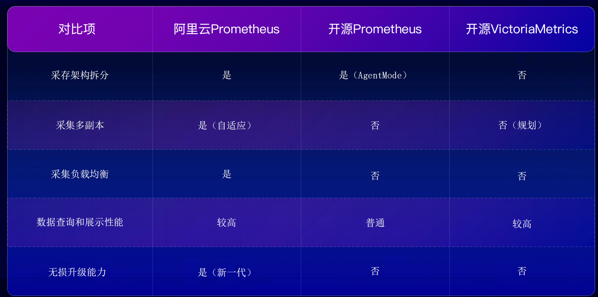

阿里云Prometheus集群具体架构如下：
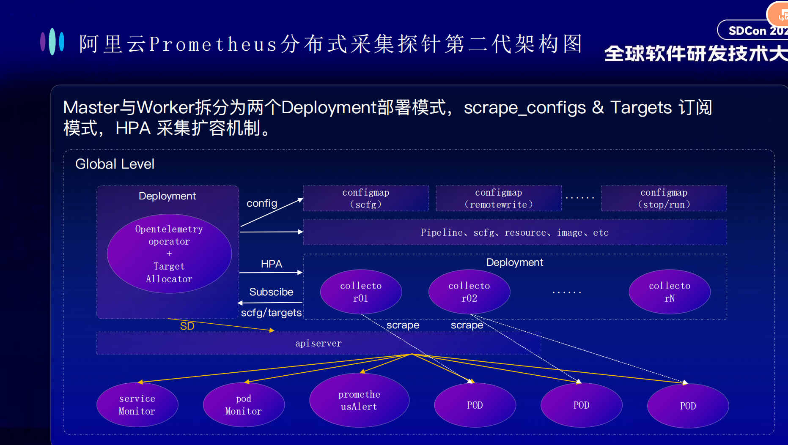

### （3）总结

- 采用master-slave分离的集群模式,即控制面仅作服务发现，执行面承担所有数据采集任务 ---好处： 便于快速扩展和无损升级，管里面master承载压力小
  
- master和slave分开部署，保持独立稳定性（和流水线类似）

## 3 方向二： 可观测 for LLM

> 议题： 《LLM应用可观测解决方案探索和实践》

### （1）背景
AI应用（chatbot、copilt、rag、agent等）的快速繁殖，AI应用存在以下挑战：

- 从演示到生产：TruEra研究表明，2023年只有10%的公司将25%的LLM应用投入生产，75%的公司没有任何LLM程序投入生产应用；
- 大模型以来的不确定性：LLM是复杂的统计模型、容易出现不可预测性，例如LLM本身无状态，响应时间超过10s，并发限流，如果没有适当的监控，则可能伤害业务指标、品牌声誉和用户信任；
- LLM架构链路长
  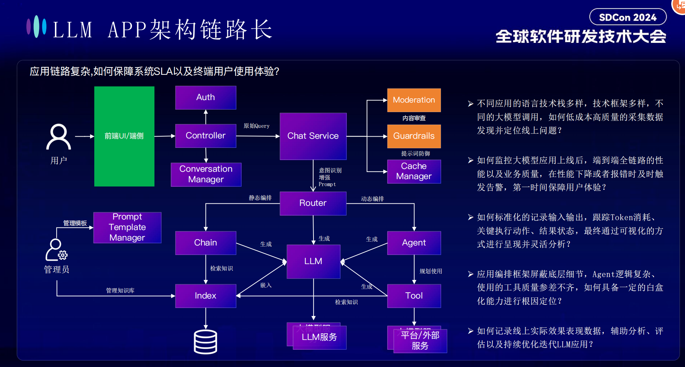
- LLM应用部署技术栈复杂，应该对结构按照功能、类型等进行解耦
### （2）分析
> LLM可观测核心：应该关注模型效率和效果的极致体验，而不是微服务的韧性
> 
#### 架构

核心两点：
- 以用户视角进行切入（和云核可观测平台一样）
- 基于trace跟踪模型等时长，并可视化呈现

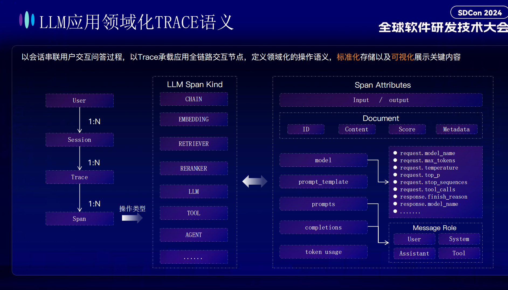

这个架构差异的核心是：大模型的指标链路等怎么定义和跟踪

阿里给的解决思路也是基于开源进行扩展自研
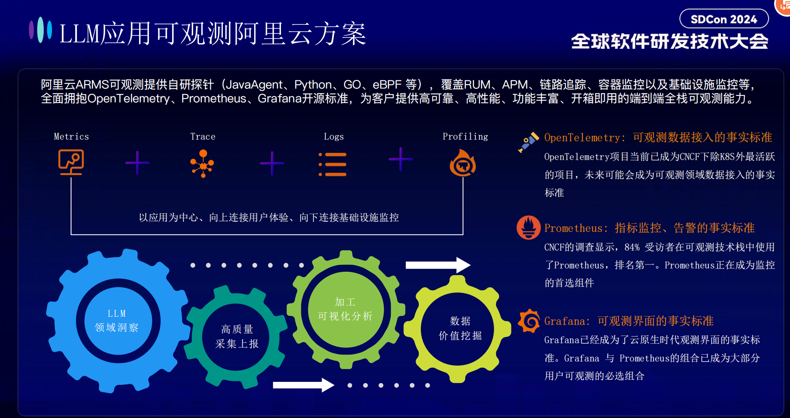

> 关键提醒：基于 `openTelemetry Python Agent`为底座进行扩展你，后续加强对这个开源软件的学习

#### 告警分析

这个确实没看懂具体实现
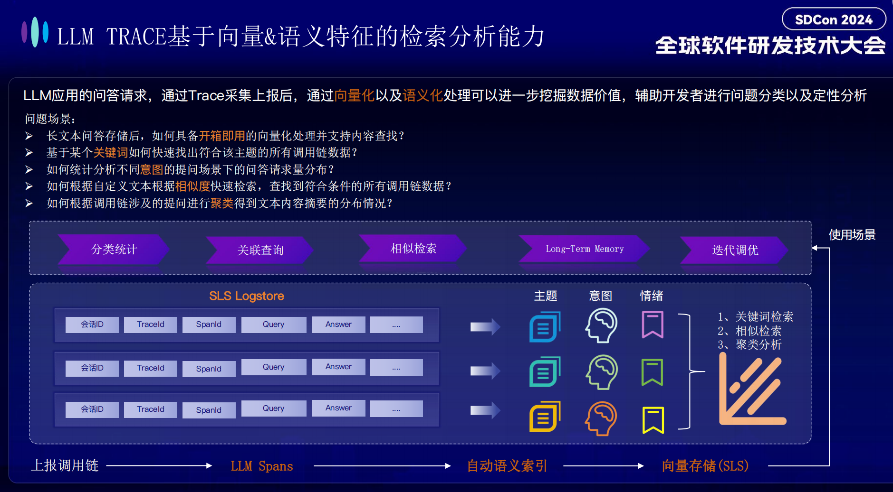

#### 效果

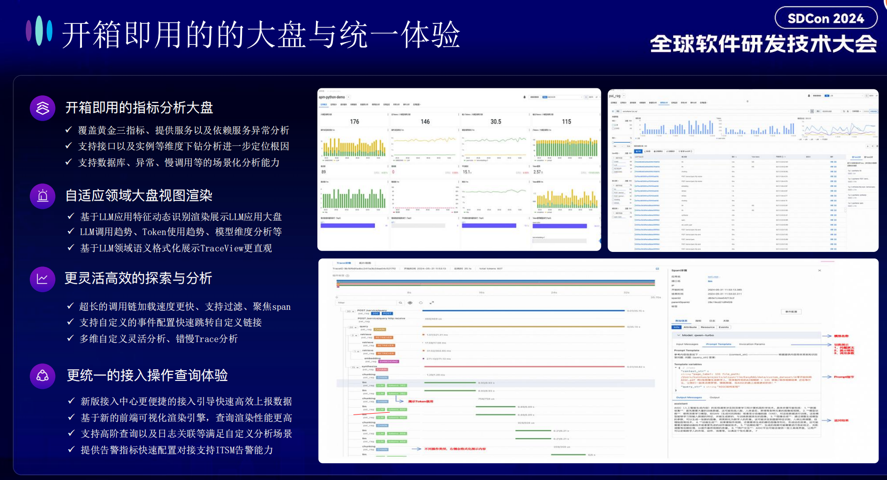
### （3）总结

> LLM应用的可观测更加关注于模型效率和体验；基于传统的可观测三要素（指标（Metrics）、跟踪（Tracing）、日志（Logging））是否完成LLM应用的可观测呢？答案是肯定的，但是传统工具缺少大模型的可观测插件等需要适配和开发

## 4 方向三： GPU资源利用率提升

> 议题： 《深度学习作业GPU利用率分析与提升》

### （1）背景
怎么在模型训练/评估/部署阶段，提升GPU的利用率，本文比较关注于实现细节

### （2）分析
#### GPU指标分析
- GPU分配利用率
- GPU使用率
- GPU实际占用率（新提出）
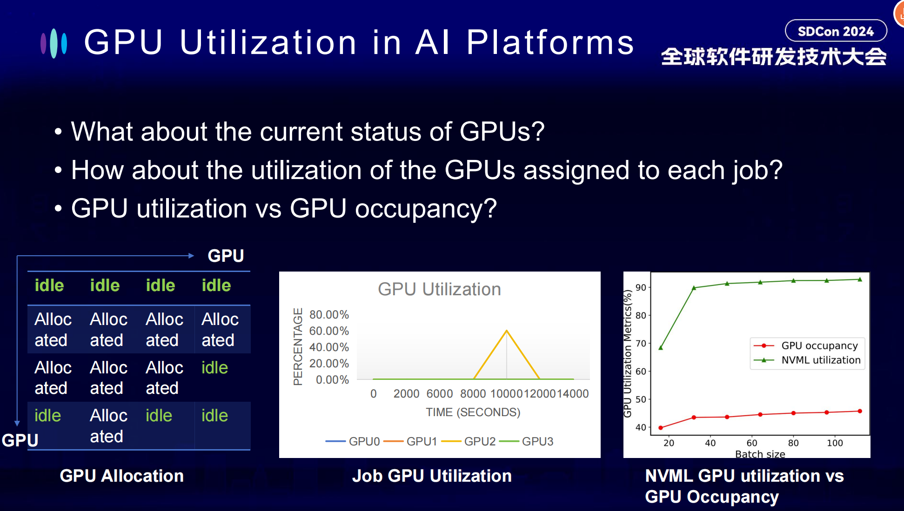

#### 系统架构
系统架构和用到的工具大家都已经很熟悉了，不再赘述
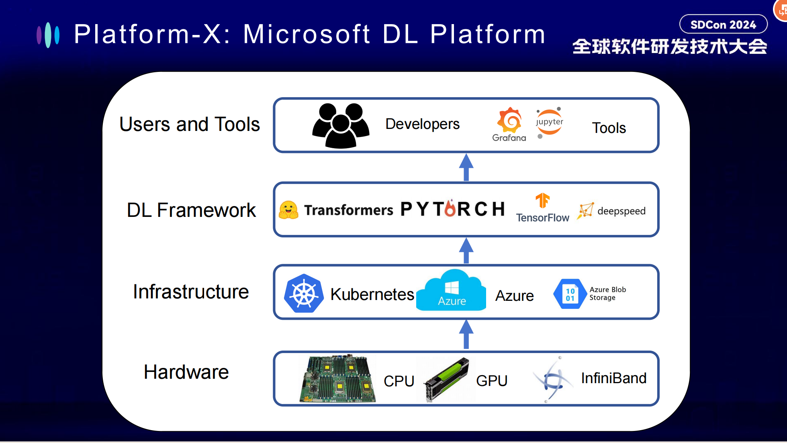
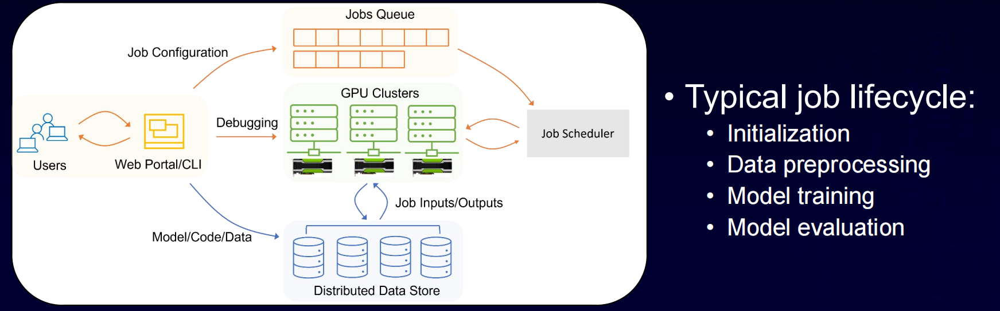

#### 分析步骤
##### （1） 收集问题进行分类
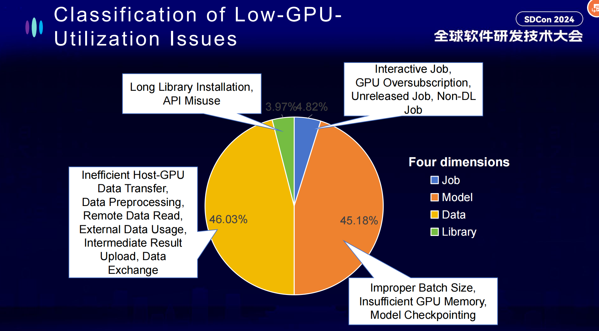

对分类进行简单陈述和可能的优化策略：
- job: 主要对资源的分配率会受影响，比如说开发态分配后实际大面积空闲、GPU超发、非DL任务占用GPU

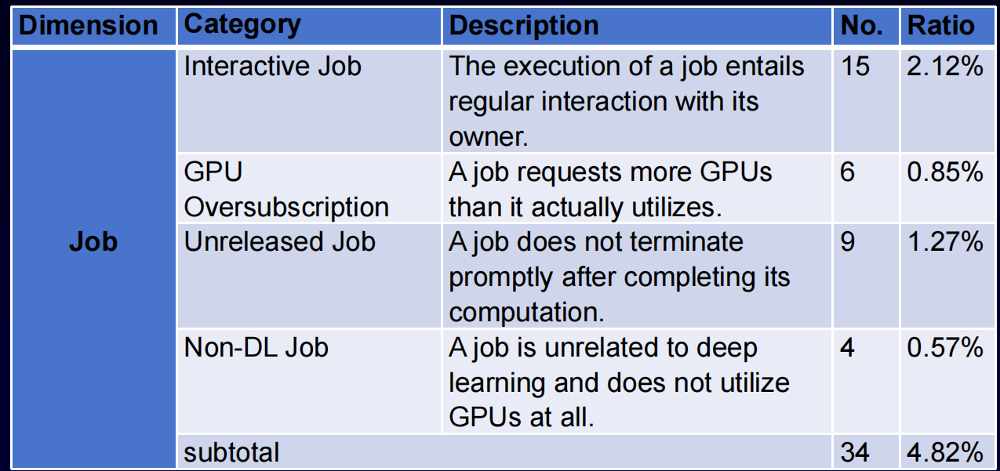

- model:模型训练的参数等，比如bitch_size参数不当（不同的显卡可能应该设置不同的bitch_size，例如测试环境和平台环境可能不一样）
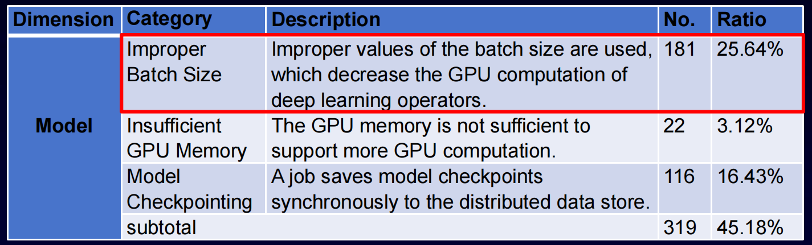

一些不同batch_size的效果：

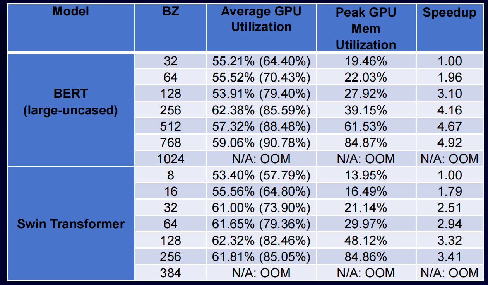

- data: 训练过程中模型/数据下载同步等
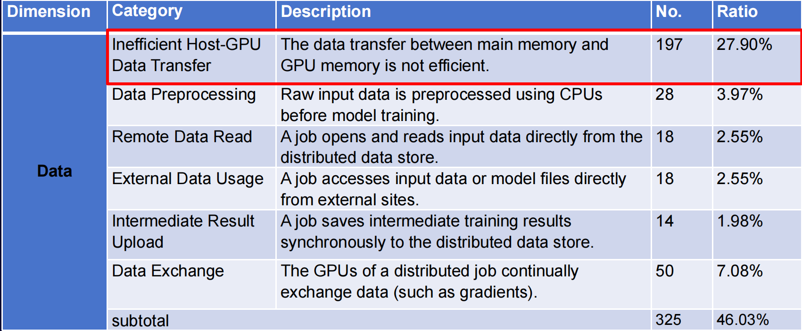

- lib: 依赖，可能框架变化太快没有更新
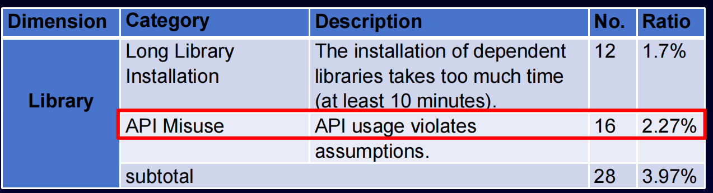

#### GPU实际占用率的提升

GPU warp（线程集），实际的线程的物理占比

挑战：
- 怎么通过工具进行获取？（获取后是否可以把两个任务放到同一个GPU？）
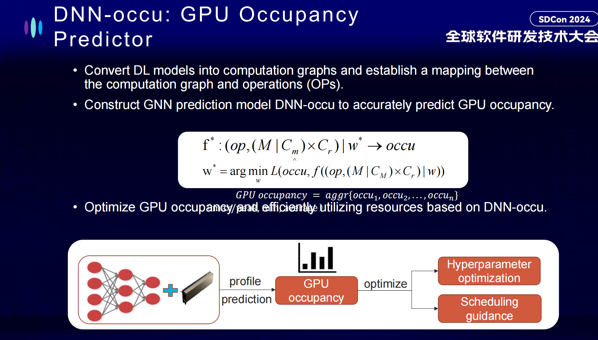
怎么提升实际占用率？（本文没有具体说明，只是提出了这么个观点。）

### （3）总结
#### JOB调度和分配
（1）开发态怎么减少分配使用率？
- 不按照机器进行分配，按照GPU进行快速申请和释放
- 支持无卡申请，确实真正需要卡的时候再重新加载

（2）怎么减少碎片化？
- 按照多机启动？

（3）预估资源利用率

（4）使用资源占用率而不是英伟达给出的使用率

#### model
（1）模型实际利用率不高怎么提升？
- batchsize参数：不同显卡的batch_size应该不同，测试环境和平台环境参数应该不一样，

## 5. 可落地分析和进展
> 最后对可能落地的IR进行拆解，具体如下：

| 可能的优化措施                   | 可能的效果           | 优先级 | 进展           |
| -------------------------------- | -------------------- | ------ | -------------- |
| 基于可挂载GPU的jupyter的开发环境 | 提升测试利用率       | 高     | 分析完成设计中 |
| 碎片化GPU                        | 提升平台GPU分配率    | 低     | 待启动         |
| 预估GPU利用率进行建议            | GPU效率提升          | 中     | 待启动         |
| 数据/模型下载改为挂载            | 数据同步效率提升     | 高     | 开发中         |
| GPU占用率分析                    | GPU进一步挖掘        | 低     | 分析中         |
| 应用agent调用链可观测            | 应用效率提升         | 中     | 待启动         |
| Prometheus集群化                 | 可观测平台稳定性提升 | 中     | 分析中         |