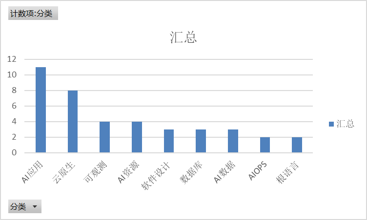

## 文档链接

文档链接：https://city.boolan.com/2024SDCon-ppt.rar

or

链接：https://pan.baidu.com/s/1vi4sBxU5-m6ORXgrXLA9Ew?pwd=kj95 
提取码：kj95

| Author           | Filename                                                 | 分类     |
| ---------------- | -------------------------------------------------------- | -------- |
| Chris Richardson | 实现快速流动的架构：通过架构支持DevOps和团队拓扑         | 云原生   |
| 刘梦馨           | Kube-OVN混合网络场景最佳实践                             | 云原生   |
| 单玉泽           | AB测试 AI大模型时代的关键引擎                            | 云原生   |
| 叶正盛           | 云原生实时数据复制技术原理与实践                         | 云原生   |
| 周新宇           | [SDCon]大数据降本利器：AutoMQ 基于云原生重新设计的 Kafka | 云原生   |
| 孙晓飞           | 小红书云原生架构的演进                                   | 云原生   |
| 梁栎鹏           | 单体vs微服务：Koupleless 模块化研发框架与运维调度系统    | 云原生   |
| 王院生           | 新能源汽车制造业API管理最佳实践                          | 云原生   |
| 张鑫             | 分布式数据库OceanBase技术架构升级之路                    | 数据库   |
| 曹伟             | KubeBlocks：以抽象与扩展API实现多数据库的统一管理        | 数据库   |
| 陈开旺           | TDSQL—C for MySQL HTAP 能力演进                          | 数据库   |
| Daniel Jackson   | 软件设计的要素——概念驱动的软件设计                       | 软件设计 |
| 曹爱虎           | DDD驱动复杂业务架构落地与实践                            | 软件设计 |
| Unknown          | 李建忠_软件开发智能化范式思考与探索                      | 软件设计 |
| 蔡健             | LLM应用可观测解决方案探索与实践                          | 可观测   |
| 隋吉智           | 阿里云Prometheus分布式采集探针在超大规模集群场景实践     | 可观测   |
| 高攀             | 移动端高可用实时可感知的业务通用监控方案                 | 可观测   |
| 高洪涛           | 基于BanyanDB的可观测性最佳实践                           | 可观测   |
| 冯新宇           | 仓颉：一款全场景智慧化应用编程语言                       | 根语言   |
| 郑东阳           | MoonBit 编程语言工具链及其架构设计                       | 根语言   |
| 林咏华           | 大模型及多元AI芯片时代的软件开发                         | AI资源   |
| 陈晓涛           | 跨平台高性能边端AI推理部署框架的应用与实践               | AI资源   |
| 陈正飞           | 构造基于Ray的下一代企业级数据流水线                      | AI资源   |
| 高彦杰           | 深度学习作业GPU利用率分析与提升                          | AI资源   |
| 刘兴东           | 京东的AIGC革新之旅：通过JoyCoder实现研发提效             | AI应用   |
| 刘政宁           | 基于计图框架的AI 辅助开发                                | AI应用   |
| 吴岸城           | 垂直行业大模型工程实践                                   | AI应用   |
| 天猪             | 从研发视角聊聊字节跳动的 AI IDE（终稿）                  | AI应用   |
| 崔宸             | AI Checklist：Qunar结合AIGC在测试域的提效实践            | AI应用   |
| 张昕东           | 人机协同趋势和效果优化实践                               | AI应用   |
| 李佳奇           | 去哪儿旅行机票主流程AIGC探索实践                         | AI应用   |
| 汪晟杰           | 代码大模型与软件工程的产品标品之路                       | AI应用   |
| 王兴龙           | 大模型时代如何打造企业专属AI IDE                         | AI应用   |
| 王初晴           | 大模型驱动的智能代码助手落地实践                         | AI应用   |
| 陈鑫             | 代码大模型技术演进与未来趋势                             | AI应用   |
| 史少锋           | 大模型时代数据开发流程的演进                             | AI数据   |
| 沈春辉           | 阿里云Lindorm – 面向AI时代的海量多模数据服务             | AI数据   |
| 黎洋             | 基于天穹领域大模型的数据研发技术分享                     | AI数据   |
| 徐勇             | 智能运维-数据、模型和应用                                | AIOPS    |
| 王亚普           | 小红书云原生可观测演进与AIOps实践                        | AIOPS    |

进行分类

| 行标签   | 计数项:分类 |
| -------- | ----------- |
| AI应用   | 11          |
| 云原生   | 8           |
| 可观测   | 4           |
| AI资源   | 4           |
| 软件设计 | 3           |
| 数据库   | 3           |
| AI数据   | 3           |
| AIOPS    | 2           |
| 根语言   | 2           |
| 总计     | 40          |

